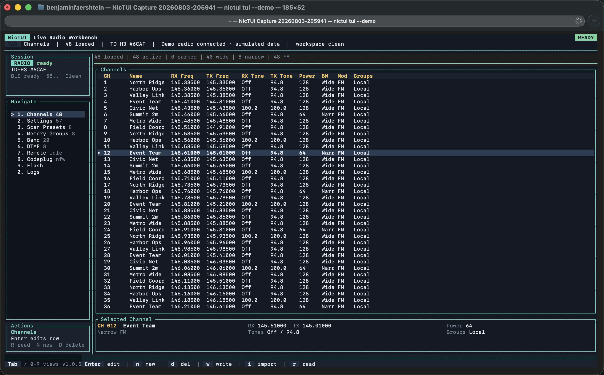
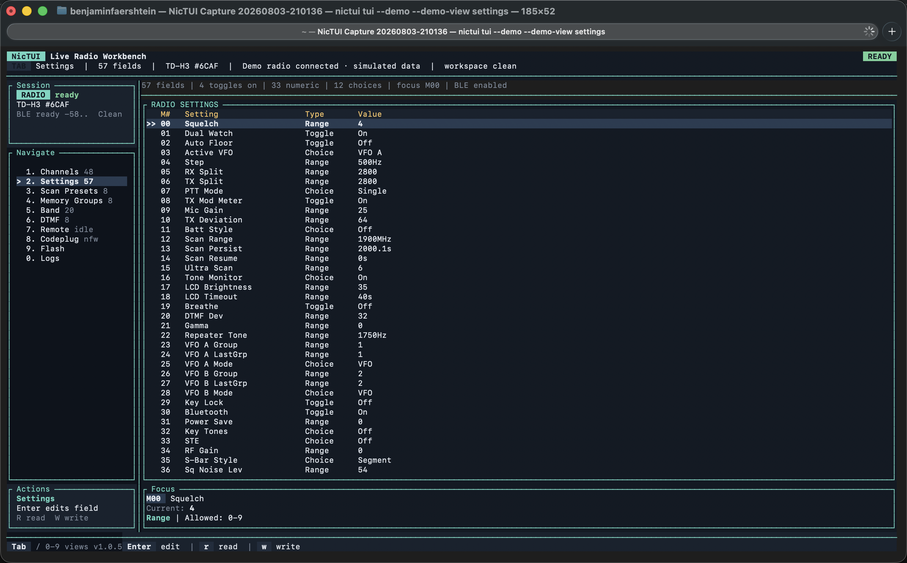
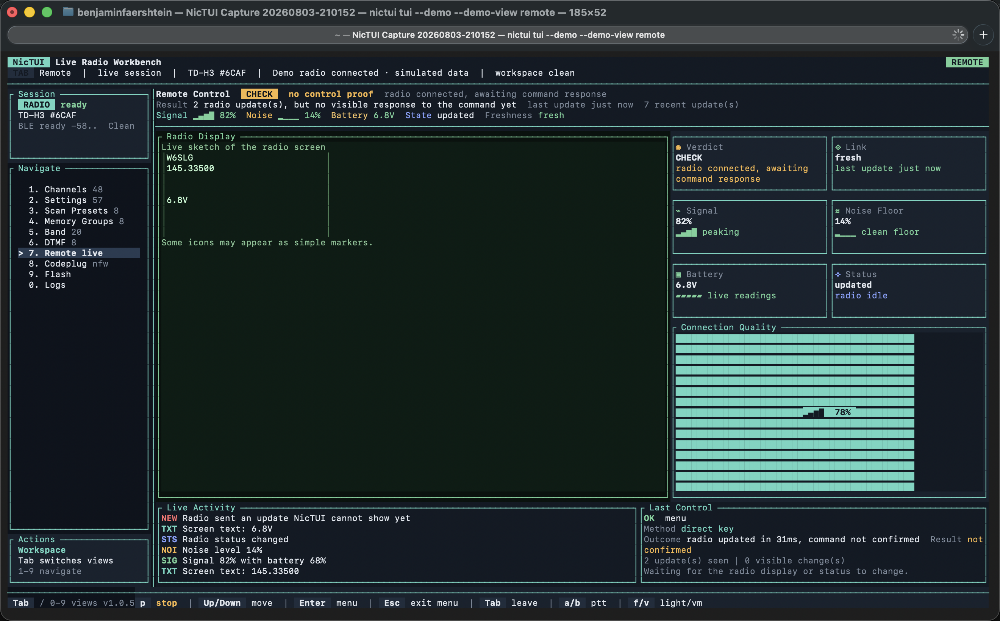

# NicTUI - Professional TDH3 Radio Programmer

A terminal-based user interface for programming the TIDRADIO TD-H3 HAM radio.

## Features

- **Channel Management** - Read, edit, and write channels to the radio
- **Settings Configuration** - Modify radio settings via the UI
- **Band Plan Editor** - Edit frequency band plans
- **DTMF Presets** - Manage DTMF signaling presets
- **Scan Presets** - Configure scanning behavior
- **Codeplug Operations** - Import/export full codeplugs
- **Firmware Flashing** - Flash firmware updates
- **Remote Control** - Send remote-control keys or inspect packets over USB serial or native BLE transport
- **AI Skill Installer** - Install a bundled Codex or Claude Code skill that mirrors the NicTUI CLI workflows

## Screenshots

These screenshots are captured from the built-in hardware-free demo workspace, so they show the real TUI layout without requiring a connected radio:

<p align="center">
  
</p>

<p align="center">
  
</p>

<p align="center">
  
</p>

Preview the same views locally with:

```bash
nictui tui --demo
nictui tui --demo --demo-view settings
nictui tui --demo --demo-view remote
```

## Installation

### Quick Install (Supported Release Platforms)

One-command installation that automatically detects your platform and installs NicTUI. On macOS, this installs the signed and notarized `NicTUI.app` bundle for the recommended Bluetooth permission UX. On Linux, Windows, and explicit CLI installs, it installs the raw `nictui` command-line binary.

```bash
curl -fsSL https://raw.githubusercontent.com/RCGV1/NicTUI/master/install.sh | bash
```

This will:
- Detect supported release targets: Linux x86_64, macOS x86_64/aarch64, or Windows x86_64 under Git Bash/MSYS/Cygwin
- Download the latest release asset
- Install `NicTUI.app` to `~/Applications` on macOS by default
- Install to `~/.local/bin/nictui` (`nictui.exe` on Windows) for Linux, Windows, or `--cli`
- Add `~/.local/bin` to your PATH only for CLI installs

For a macOS CLI-only scripting install instead of the app bundle:

```bash
curl -fsSL https://raw.githubusercontent.com/RCGV1/NicTUI/master/install.sh | bash -s -- --cli
```

**After CLI installation, restart your terminal or run:**
```bash
source ~/.bashrc  # or ~/.zshrc, ~/.profile, etc.
```

Then start the interactive UI with:
```bash
nictui
```

### Manual Installation

#### Linux/macOS

```bash
# Download the binary
curl -LO https://github.com/RCGV1/NicTUI/releases/latest/download/nictui-{version}-{platform}

# Example for Linux x86_64:
# curl -LO https://github.com/RCGV1/NicTUI/releases/latest/download/nictui-1.0.0-linux-x86_64

# Make executable
chmod +x nictui-{version}-{platform}

# Move to a directory in your PATH
mkdir -p ~/.local/bin
mv nictui-{version}-{platform} ~/.local/bin/nictui

# Add to PATH (add to ~/.bashrc or ~/.zshrc)
export PATH="$HOME/.local/bin:$PATH"
```

On macOS, releases ship zipped app bundles named `NicTUI-{version}-macos-x86_64.app.zip` for Intel and `NicTUI-{version}-macos-aarch64.app.zip` for Apple Silicon. Prefer the app bundle for normal interactive use and first-run Bluetooth permission attribution, then launch it directly from Finder or with:

```bash
open /path/to/NicTUI.app
```

Release CI can sign and notarize macOS CLI and app bundle assets when maintainer-only credentials are configured. The raw macOS CLI assets are intended for scripting and advanced terminal workflows; use the app bundle for the recommended public macOS UX. Without release signing credentials, app bundles are ad-hoc signed by default for development; local builds can also pass `--no-sign` to `scripts/build_macos_app.sh` for unsigned bundles.

#### Windows

Download `nictui-{version}-windows-x86_64.exe` from [Releases](https://github.com/RCGV1/NicTUI/releases) and run it from Command Prompt or PowerShell.

### Update NicTUI

To update to the latest version:

```bash
# Re-run the install script
curl -fsSL https://raw.githubusercontent.com/RCGV1/NicTUI/master/install.sh | bash

# Or manually download the new version and replace the binary
```

### Check Version

```bash
nictui --version
```

### Uninstall

```bash
rm -f ~/.local/bin/nictui
```

## Usage

Running `nictui` with no arguments launches the full-screen TUI.

1. Connect your TD-H3 radio to the computer via USB
2. Select the appropriate serial port
3. Use the arrow keys to navigate between tabs
4. Press the indicated keys to perform actions

The TUI port picker auto-detects USB serial ports on startup. On Linux and Windows it also starts a BLE scan automatically; on macOS it avoids first-run Bluetooth permission prompts at startup, so press `b` to scan BLE or `r` to refresh USB plus BLE when you are ready.

To launch the TUI over BLE instead of USB serial:

```bash
nictui bluetooth scan
export NICTUI_BLE_DEVICE="<uuid-from-bluetooth-scan>"
nictui tui --ble-device "$NICTUI_BLE_DEVICE"
# or resolve by advertised name:
nictui tui --ble-name TD-H3
```

When you exit the TUI, NicTUI will print a hint about the bundled AI skill if it detects `codex` or `claude` on your system.

## AI Skill

NicTUI ships with a bundled skill for Codex and Claude Code. The skill uses the NicTUI CLI only, requires NicSure mod firmware on the radio, backs up the radio data it changes, prefers targeted updates over bulk writes, and runs `--validate-only` before real writes.

Install into detected agent directories:

```bash
nictui skill install
```

Inspect the bundled skill and install paths:

```bash
nictui skill show
nictui skill paths
```

Force a specific target:

```bash
nictui skill install --agent codex
nictui skill install --agent claude
nictui skill install --agent all
```

Installed locations:

- Codex: `$CODEX_HOME/skills/nictui-radio-cli` or `~/.codex/skills/nictui-radio-cli`
- Claude Code: `~/.claude/skills/nictui-radio-cli`

### Publishing and Discovery

The bundled skill lives at [skills/nictui-radio-cli](skills/nictui-radio-cli) and is the source of truth for the AI workflow text. The Claude Code plugin copy lives at [plugins/nictui-radio-cli-plugin](plugins/nictui-radio-cli-plugin) and mirrors the same `SKILL.md` content.

Use the CLI to inspect what gets installed where:

```bash
nictui skill show
nictui skill paths
nictui skill paths --agent codex
nictui skill paths --agent claude
```

Claude Code users can validate and install the local plugin package from this repo through the plugin marketplace flow.

## CLI

NicTUI includes a non-interactive CLI for scripting, inspection, and batch workflows. It works over USB serial or native BLE. Use `ports --verbose` or `ports --json` to discover USB serial targets, `bluetooth scan` to discover BLE UUIDs, then reuse the resolved value in commands. Use `--ble-device` for an explicit UUID, `--ble-name` for a name lookup, or a `ble://<uuid>` port value when a command accepts `--port`.
The safest non-interactive workflow is: `ports` -> `probe` -> `read` -> `--validate-only` -> actual write. If `probe` or `doctor` reports `stock/original` firmware, install NicSure mod firmware before using live read/write commands.
Some NicSure builds still reject live-mode handshakes. If live-mode block access repeatedly fails after recovery, treat it as unsupported on that firmware and use the normal read/write commands instead.
For focused edits, prefer the single-record commands like `channels get`, `channels update`, `settings get`, and `settings set`.
Use `ports --verbose` or `ports --json` when you need precise port metadata, `probe --json` when a script needs structured radio facts, and `remote` commands when you want key injection or packet capture instead of codeplug editing.

### Discover Ports

```bash
nictui ports
nictui ports --verbose
nictui ports --json
export NICTUI_PORT="<serial-port-from-nictui-ports>"
nictui probe --port "$NICTUI_PORT"
nictui probe --json
```

### Recommended Health Check

```bash
# Quick read-only check
nictui doctor --port "$NICTUI_PORT"

# Save JSON artifacts for every readable section
nictui doctor --port "$NICTUI_PORT" --output-dir ./doctor-artifacts

# Include the full EEPROM dump and print the report as JSON
nictui doctor --port "$NICTUI_PORT" --codeplug --json --output-dir ./doctor-artifacts
```

### Work With Channels

```bash
# Read channels from the radio to CSV
nictui channels read --port "$NICTUI_PORT" --output channels.csv

# Read channels as JSON to stdout
nictui channels read --port "$NICTUI_PORT"

# Validate a CSV or JSON channel file without touching the radio
nictui channels write --port "$NICTUI_PORT" --input channels.json --validate-only

# Write channels from CSV or JSON back to the radio
nictui channels write --port "$NICTUI_PORT" --input channels.csv --reboot
```

### Target One Channel

```bash
# Read one channel as JSON
nictui channels get --port "$NICTUI_PORT" --channel 25

# Save one channel as CSV or JSON
nictui channels get --port "$NICTUI_PORT" --channel 25 --output channel-25.json
nictui channels get --port "$NICTUI_PORT" --channel 25 --output channel-25.csv

# Validate a one-channel patch file without touching the radio
nictui channels update --port "$NICTUI_PORT" --channel 25 --input channel-25.json --validate-only

# Replace one channel slot from a single CSV row or JSON record
nictui channels update --port "$NICTUI_PORT" --channel 25 --input channel-25.json

# Clear one channel slot
nictui channels clear --port "$NICTUI_PORT" --channel 25

# Clear an inclusive range of channel slots
nictui channels clear-range --port "$NICTUI_PORT" --start 26 --end 198
```

### Read Radio Sections

```bash
nictui settings read --port "$NICTUI_PORT" --output settings.json

nictui groups read --port "$NICTUI_PORT" --output groups.json

nictui scan-presets read --port "$NICTUI_PORT" --output scan-presets.json

nictui band-plan read --port "$NICTUI_PORT" --output band-plan.json

nictui dtmf read --port "$NICTUI_PORT" --output dtmf.json
```

### Work With Group Labels

```bash
# Read one group label
nictui groups get --port "$NICTUI_PORT" --group 3

# Validate a group label update without touching the radio
nictui groups set --port "$NICTUI_PORT" --group 3 --label FRS --validate-only

# Update one group label
nictui groups set --port "$NICTUI_PORT" --group 3 --label FRS
```

### Target One Setting

```bash
# Read one setting by menu number
nictui settings get --port "$NICTUI_PORT" --setting 17

# Read one setting by name
nictui settings get --port "$NICTUI_PORT" --setting "LCD Brightness"

# Validate one setting change without touching the radio
nictui settings set --port "$NICTUI_PORT" --setting 17 --value 12 --validate-only

# Update one setting by menu number or name
nictui settings set --port "$NICTUI_PORT" --setting 17 --value 12
nictui settings set --port "$NICTUI_PORT" --setting "Key Tones" --value Voice
```

### Bluetooth / BLE

```bash
# Scan for TD-H3 BLE radios
nictui bluetooth scan

# Check BLE readiness before opening a session
nictui bluetooth doctor
nictui bluetooth doctor --name TD-H3
export NICTUI_BLE_DEVICE="<uuid-from-bluetooth-scan>"
nictui bluetooth doctor --device "$NICTUI_BLE_DEVICE"

# Resolve a BLE radio explicitly
nictui bluetooth connect --device "$NICTUI_BLE_DEVICE"
nictui bluetooth connect --name TD-H3

# Read the current Bluetooth state
nictui bluetooth status --port "$NICTUI_PORT"

# Validate enabling BLE without touching the radio
nictui bluetooth on --port "$NICTUI_PORT" --validate-only

# Enable BLE and reboot the radio
nictui bluetooth on --port "$NICTUI_PORT"

# Talk to the radio directly over BLE
nictui probe --ble-device "$NICTUI_BLE_DEVICE"
nictui channels read --ble-name TD-H3

# Disable BLE later if needed
nictui bluetooth off --port "$NICTUI_PORT"
```

When Bluetooth is enabled, NicSure firmware advertises the radio for BLE app access. NicTUI talks to that BLE transport natively when you pass `--ble-device`, `--ble-name`, or a `ble://...` port. `nictui bluetooth on` only toggles the radio-side Bluetooth setting; it does not connect your local session. The expected UUIDs are service `0000ff00-0000-1000-8000-00805f9b34fb`, notify/read `0000ff01-0000-1000-8000-00805f9b34fb`, and write `0000ff02-0000-1000-8000-00805f9b34fb`. In the TUI port picker, Linux and Windows start BLE discovery automatically; on macOS, press `b` to scan after launch.

Use `nictui bluetooth doctor` when BLE setup is unclear. It distinguishes likely macOS Bluetooth/TCC attribution problems from "no radio found", target selection mistakes, and radio-side transport failures, then prints the next action. On macOS, run it first if BLE works inconsistently from Codex, other hosted wrappers, or a fresh NicTUI install before you assume the radio or protocol is broken.
If you are launching from a GitHub release on macOS, prefer the `NicTUI-{version}-macos-x86_64.app.zip` or `NicTUI-{version}-macos-aarch64.app.zip` asset for that first permission grant path.

### Validate Before Writing

```bash
nictui settings write --port "$NICTUI_PORT" --input settings.json --validate-only
nictui scan-presets write --port "$NICTUI_PORT" --input scan-presets.json --validate-only
nictui band-plan write --port "$NICTUI_PORT" --input band-plan.json --validate-only
nictui dtmf write --port "$NICTUI_PORT" --input dtmf.json --validate-only
nictui codeplug write --port "$NICTUI_PORT" --input radio.nfw --validate-only
nictui firmware flash --port "$NICTUI_PORT" --input firmware.bin --validate-only
```

### Write Radio Sections

```bash
nictui settings write --port "$NICTUI_PORT" --input settings.json
nictui scan-presets write --port "$NICTUI_PORT" --input scan-presets.json
nictui band-plan write --port "$NICTUI_PORT" --input band-plan.json
nictui dtmf write --port "$NICTUI_PORT" --input dtmf.json
```

### Target One Indexed Record

```bash
# Read one scan preset, band plan, or DTMF preset
nictui scan-presets get --port "$NICTUI_PORT" --index 2
nictui band-plan get --port "$NICTUI_PORT" --index 4
nictui dtmf get --port "$NICTUI_PORT" --index 1

# Validate one record update without touching the radio
nictui scan-presets update --port "$NICTUI_PORT" --index 2 --input scan-preset-2.json --validate-only
nictui band-plan update --port "$NICTUI_PORT" --index 4 --input band-plan-4.json --validate-only
nictui dtmf update --port "$NICTUI_PORT" --index 1 --input dtmf-1.json --validate-only

# Update one record in place
nictui scan-presets update --port "$NICTUI_PORT" --index 2 --input scan-preset-2.json
nictui band-plan update --port "$NICTUI_PORT" --index 4 --input band-plan-4.json
nictui dtmf update --port "$NICTUI_PORT" --index 1 --input dtmf-1.json
```

### Read, Inspect, or Write Codeplugs

```bash
# Read the full EEPROM into a .nfw file
nictui codeplug read --port "$NICTUI_PORT" --output radio.nfw

# Inspect a codeplug summary
nictui codeplug inspect --input radio.nfw

# Dump the full inspection payload as JSON
nictui codeplug inspect --input radio.nfw --json

# Validate a .nfw file before writing it
nictui codeplug write --port "$NICTUI_PORT" --input radio.nfw --validate-only

# Write a .nfw file back to the radio
nictui codeplug write --port "$NICTUI_PORT" --input radio.nfw
```

### Flash Firmware

```bash
# Validate the firmware image first
nictui firmware flash --port "$NICTUI_PORT" --input firmware.bin --validate-only

# Flash the validated image
nictui firmware flash --port "$NICTUI_PORT" --input firmware.bin
```

### Serial Port Notes

- Only one NicTUI or serial tool can own the discovered serial port at a time.
- If a command says the port is busy, close other NicTUI sessions, serial monitors, or flashing tools first.
- For repeatable scripting on macOS, prefer the callout device shown by `nictui ports --verbose`.

### Remote CLI

```bash
nictui remote key --port "$NICTUI_PORT" --key flashlight
nictui remote key --port "$NICTUI_PORT" --key ptt-a
nictui remote capture --port "$NICTUI_PORT" --duration 8 --send menu
nictui remote probe --port "$NICTUI_PORT" --preset menu
nictui remote diagnose --port "$NICTUI_PORT" --json
nictui remote pvojh-sweep --port "$NICTUI_PORT" --gap-ms 0,50,100 --json
```

Use `remote` for the radio's control session, not for codeplug reads or writes.
`remote probe --preset ...` names a logical action such as `menu`; NicTUI translates that preset to the programmer's wire bytes automatically. Use `remote probe --bytes ...` only when you want to inject literal wire bytes yourself.
If you are reverse-engineering a NicSure build, start with `remote diagnose`: it runs a small fixed suite and distinguishes confirmed control from telemetry-only behavior.
On some NicSure builds, `telemetry-prime` can wake telemetry without proving command control. Expect honest JSON such as `telemetry-primed` or `primed-telemetry-carrythrough` with `remote_control_confirmed: false` until a command produces a decoded control delta.
`remote key` also reports observed reaction evidence now. Treat RX, surfaced packets, or carrythrough telemetry without a decoded delta as session activity, not confirmed control.

### Full Help

```bash
nictui --help
nictui channels --help
nictui settings write --help
nictui codeplug inspect --help
```

### Key Bindings

| Key | Action |
|-----|--------|
| `Tab` | Next tab |
| `Shift+Tab` | Previous tab |
| `1-9` | Jump to tabs 1 through 9 |
| `0` | Jump to Debug |
| `q` | Quit application |
| `r` | Read from radio |
| `w` | Write to radio |
| `Enter` | Open or edit the selected item where supported |
| `Esc` | Cancel / Go back |

### Tab-Specific Bindings

**Channels Tab:**
- `n` - Add new channel
- `Enter` - Edit selected channel
- `e` - Export channels
- `d` - Delete channel
- `u` - Undelete a channel marked for deletion

**Settings Tab:**
- `Enter` - Edit setting

**Scanning Tab:**
- `Enter` - Edit scan preset

**Memory Groups Tab:**
- `Enter` - Rename selected memory group
- `r` - Refresh channels and group labels
- `w` - Save changed group names

**Band Plan Tab:**
- `Enter` - Edit band plan

**DTMF Tab:**
- `Enter` - Edit DTMF preset

**Remote Tab:**
- `o` - Connect to radio
- `p` - Disconnect from radio
- `0-9` - Radio keys
- `a` - PTT A
- `b` - PTT B
- `f` - Flashlight

**Codeplug Tab:**
- `i` - Import codeplug
- `e` - Export codeplug
- `w` - Write codeplug

**BIN Flash Tab:**
- `i` - Import firmware file
- `f` - Start flash

## UI Capture

Maintainers working on TUI polish can use the local macOS capture helper in `scripts/tui_capture_macos.py`. Run `python3 scripts/tui_capture_macos.py --help` from a checkout for current options. Use `--demo` and `--demo-view` to capture deterministic screenshots without hardware.

## Building from Source

```bash
git clone https://github.com/RCGV1/NicTUI.git
cd NicTUI
cargo build --release
cargo run --bin nictui
```

### Dependencies (Linux)

- libgtk-3-dev
- libudev-dev

## License

This program is free software: you can redistribute it and/or modify it under the terms of the GNU General Public License as published by the Free Software Foundation, either version 3 of the License, or (at your option) any later version.

This program is distributed in the hope that it will be useful, but WITHOUT ANY WARRANTY; without even the implied warranty of MERCHANTABILITY or FITNESS FOR A PARTICULAR PURPOSE. See the GNU General Public License for more details.

You should have received a copy of the GNU General Public License along with this program. If not, see <https://www.gnu.org/licenses/>.

## Links

- [Source Code](https://github.com/RCGV1/NicTUI)
- [Protocol Documentation](https://github.com/nicsure/nicfw2docs)
- [TIDRADIO TD-H3](https://tidradio.com/products/td-h3)
